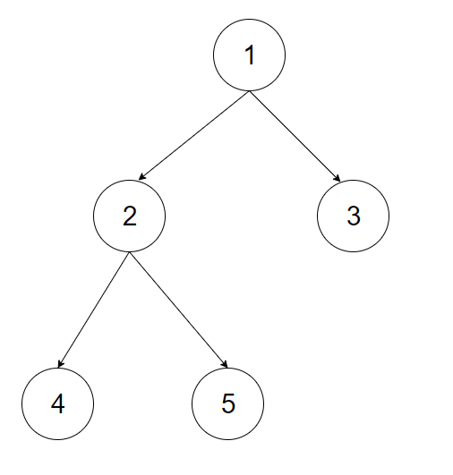
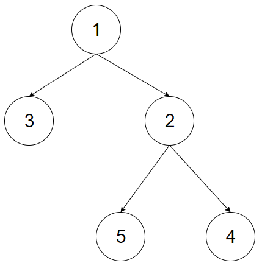

# Part 1: BFS, DFS, Recursive DFS  
These are the basic graph algorithms.  
A lot of interview problems can be solved with these two algorithms.  

I will enumerate some problems or algorithms that use DFS:  
* Detecting cycle in a graph
* Path finding
* Topological sorting
* Bipartite graph testing
* Finding strongly connected components

I will enumerate some problems or algorithms that use BFS:  
* Shortest Path
* Minimum Spanning Tree (unweighted graph)
* Bipartite graph 
* Finding all the nodes in a connected component.

# Part 2. Basic tree algorithms.

    
      
    In order traversal (Left Root Right) 4 2 5 1 3  
    Pre order traversal (Root Left Right) 1 2 4 5 3  
    Post order traversal (Left Right Root) 4 5 2 3 1  
    
An easy way of remebering these traversal is to keep in mind that  
you have to place the Root in Left Right as the first word indicates you.  
Example Pre order: the root is before Left Right  
The python code for the traversals can be found in tree_traversals.py  

    Level order tree traversal. 1 | 2 3 | 4 5 |  

    Mirror tree. (see the second tree figure)
    

    
